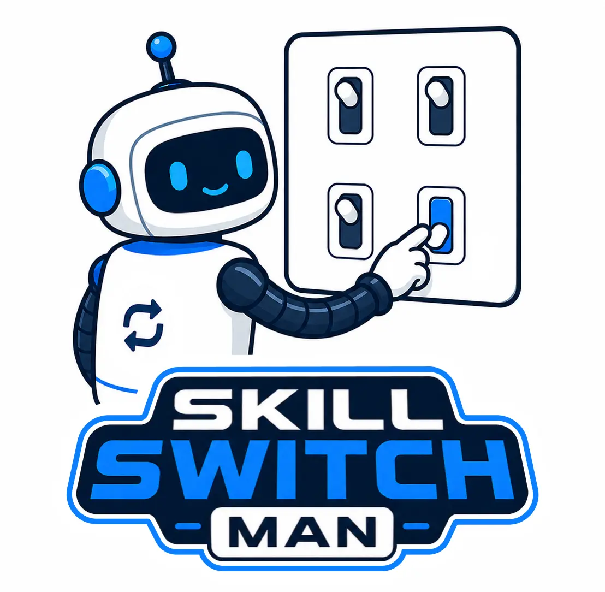

# skill-switch-man

<p align="center">
  
</p>

`skill-switch-man` is a terminal UI for enabling the same reusable agent skills across Claude Code, Codex, and OpenCode. The installed command is `skillswitchman`.

It keeps your skill source directory separate from each tool's active skills directory, then links the skills you enable into the right target location.

## Features

- Manage Claude Code, Codex, and OpenCode skills from one TUI.
- Use one shared skill store as the source of truth.
- Enable or disable skills independently for each tool.
- Preview pending changes before they are applied.
- Detect manually installed or externally linked skills as untracked entries.
- Avoid overwriting untracked skills when a name conflict is detected.
- Preserve nested skill folders and discover skills by `SKILL.md`.
- Import skills from any GitHub repository via `add-store`.
- Generate an HTML status page via `view-html`.

## Supported Tools

| Tool | Active skills directory |
| --- | --- |
| Claude Code | `~/.claude/skills` |
| Codex | `~/.codex/skills` |
| OpenCode | `~/.opencode/skills` |

## Installation

Install from a local checkout:

```sh
cargo install --path .
```

For development, run it directly:

```sh
cargo run
```

## Usage

Start the TUI:

```sh
skillswitchman
```

The app lists skills from the configured skill store. A skill is any directory that contains a `SKILL.md` file.

Key bindings:

| Key | Action |
| --- | --- |
| `Left` / `Right`, `h` / `l` | Switch tool tab |
| `Up` / `Down`, `j` / `k` | Move selection |
| `Space` | Toggle the selected skill for the active tool |
| `Enter` | Review and save pending changes |
| `Esc`, `q` | Quit |

Changes are not written to `settings.json` until you confirm them with `Enter`. The confirmation dialog shows the skills that will be added or removed for each tool.

## Configuration

The configuration file is created automatically on first run:

```text
~/.config/skill-switch-man/settings.json
```

Use `skills_source_dir` to choose where reusable skills are stored:

```json
{
  "skills_source_dir": "~/src/skill-store",
  "enabled_skills": {
    "claude": ["browser-use"],
    "codex": ["browser-use", "imagegen"],
    "opencode": []
  }
}
```

Default configuration:

```json
{
  "skills_source_dir": "~/.config/skill-switch-man/skill-store",
  "enabled_skills": {
    "claude": [],
    "codex": [],
    "opencode": []
  }
}
```

For compatibility, `source_dir` and `skill_store_dir` are accepted when reading configuration. Saved configuration is always written back as `skills_source_dir`.

## Skill Store Layout

Example:

```text
~/src/skill-store/
  browser-use/
    SKILL.md
  imagegen/
    SKILL.md
  writing/
    blog-editor/
      SKILL.md
```

Subdirectories are shown as folders in the TUI. Only directories containing `SKILL.md` are treated as skills.

## Untracked Skills

Skills that already exist in `~/.claude/skills`, `~/.codex/skills`, or `~/.opencode/skills` but do not point into the configured `skills_source_dir` are shown as untracked skills with a `!` marker.

If an untracked skill has the same name as a skill in the source store, it is shown with `name conflict`. In that state, `skill-switch-man` will not overwrite the manual skill or external symlink. Rename or remove the manual entry, or move it into `skills_source_dir` if you want this tool to manage it.

## CLI Reference

```sh
skillswitchman --help
skillswitchman --version
```

### `add-store` — Import skills from a GitHub repository

```sh
skillswitchman add-store <URL>
```

Clones a GitHub repository, scans it for skills (directories containing `SKILL.md`), and copies them into the skill store.

Supports:

- Standard HTTPS URLs: `https://github.com/owner/repo`
- `.git` suffix: `https://github.com/owner/repo.git`
- Subdirectory via tree path: `https://github.com/owner/repo/tree/main/skills/grill-me`

If multiple skills are found, an interactive selector lets you choose which ones to import. If a skill already exists in the store, you are prompted to confirm the overwrite.

### `view-html` — Open a status page in the browser

```sh
skillswitchman view-html
```

Generates an HTML status page showing all skills, their enabled state per tool, and any untracked skills, then opens it in the default browser.

## Development

Common checks:

```sh
cargo fmt
cargo test
cargo clippy
```

## Contributing

Issues and pull requests are welcome. Please keep changes focused, include tests for behavior changes, and run the development checks before submitting.

## License

MIT
